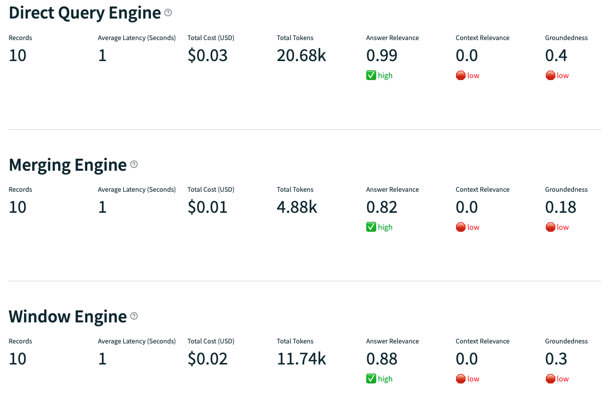

# Boosting RAG Metrics: Two Practical Methods

Retrieval-Augmented Generation (RAG) is a powerful framework used to enhance the contextual understanding of Large Language Models (LLMs) by incorporating additional knowledge. By extending the context provided to LLMs, RAG enables them to generate more accurate and relevant responses, making it particularly valuable for companies seeking personalized interactions with their data.

## Understanding the RAG Process

The RAG process can be broken down into three main phases:

- Indexing: External data is indexed by chunking the text from documents, computing embeddings, and storing them in a specialized database known as `VectorStores`.
- Retrieval: During retrieval, the embedding of a query is computed, and chunks that are most relevant to it are retrieved to serve as context for generating a response.
- Generation: Leveraging the retrieved context, the LLM formulates its response.

## Naive RAG implementation with Llama-index

### Prerequisites

To run the provided code, ensure you have Python 3.11.7 installed along with the following dependencies: 
```py
jupyter
llama-index==0.10.34
llama-index-embeddings-huggingface==0.2.0
openai==1.25.1
python-dotenv #reads .env file
trulens-eval==0.28.2 #used to evaluate RAGs
```
Define the following variables in a `.env` file:
```py
OPENAI_API_KEY=<insert your OpenAI API key>
HUGGINGFACE_API_KEY=<insert your Hugging Face API key>
``` 

### Getting Data

Download a sample text file of Paul Graham's essay for demonstration:
```py
!mkdir -p '../data'
!wget 'https://raw.githubusercontent.com/run-llama/llama_index/main/docs/docs/examples/data/paul_graham/paul_graham_essay.txt' -O '../data/paul_graham_essay.txt'
```

### Naive RAG Implementation

For this experiment, we will use OpenAI for the LLM and BGE as embedding model. `ServiceContext` has been deprecated since the version v.0.10.0 of llama-index and replaced by `Settings`.
The `Settings` object enables to set global parameters and those are lazily instantiated. This means that only required elements will be loaded into memory.

```py
from llama_index.core import Settings
from llama_index.embeddings.huggingface import HuggingFaceEmbedding
from llama_index.llms.openai import OpenAI

Settings.llm = OpenAI(model="gpt-3.5-turbo", temperature=0.1)
Settings.embed_model = HuggingFaceEmbedding(
    model_name="BAAI/bge-small-en-v1.5"
)
```

With Llama-index, implementing a Naive RAG is incredibly simple:

```py
from llama_index.core import SimpleDirectoryReader, VectorStoreIndex

documents = SimpleDirectoryReader(
    input_files=["../data/paul_graham_essay.txt"]
).load_data()
index = VectorStoreIndex.from_documents(documents)
query_engine = index.as_query_engine()
response = query_engine.query("What did Paul Graham study?")
str(response)
```

## Limitations and Causes

While Naive RAG implementations offer a quick way to interact with documents, the quality of their responses is only as good as the context they retrieve. Tuning parameters like `chunk_size` can significantly impact performance. However, other approaches, such as Sentence Window Retrieval, have proven effective in retrieving the most relevant context.

## Sentence Window Retrieval

By default, the `VectorStoreIndex` splits documents into chunks before computing their embeddings. However, you have the flexibility to control how your documents are parsed by selecting a different type of `node_parser`. In this case, we'll utilize the `SentenceWindowNodeParser`, which parses documents into single-sentence nodes while retaining the preceding and following sentences in the metadata field "window".

Setting a window size of 1 means that the "window" field will contain one sentence on either side of the original sentence. This approach significantly improves context relevance during retrieval, as it provides a more comprehensive context for each sentence.

```py
node_parser = SentenceWindowNodeParser.from_defaults(
        window_size=1,
        window_metadata_key="window",
        original_text_metadata_key="original_text",
    )
sentence_index = VectorStoreIndex.from_documents(
            document,
            node_parser=node_parser,
        )
```

The `MetadataReplacementPostProcessor` functions by swapping out the node's content with a specific field from the node metadata—referred to as "window" in this instance. **In practical terms, while the retrieval process solely relies on the node content to locate similar nodes based on the query, it's the "window" metadata, comprising the original text and adjacent sentences, that's fed into the re-ranker. This input allows the re-ranker to evaluate the context and identify the nodes most valuable for addressing the query.**

The re-ranking is executed with the `SentenceTransformerRerank` class and leverages the BGE embeddings. This step selects the most informative nodes to answer the query, preventing the context window from being cluttered with irrelevant data. As a result, re-ranking often reduces the number of tokens used and decreases latency.

```py
postproc = MetadataReplacementPostProcessor(target_metadata_key="window")
rerank = SentenceTransformerRerank(
    top_n=top_n, 
    model="BAAI/bge-reranker-base"
)
sentence_window_engine = sentence_index.as_query_engine(
    similarity_top_k=similarity_top_k, 
    node_postprocessors=[postproc, rerank]
)
```

In this example, the top `similarity_top_k` most similar nodes to the query are initially retrieved. These nodes are then re-ranked based on their relevance to answering the query. Only the top `top_n` examples are retained and added to the context for generating the answer.

## Automerging Retrieval

Another commonly used parser is the `HierarchicalNodeParser`. This parser recursively split a document in chunks. This builds a hierarchy of nodes that are connected to their parent.

```py
node_parser = HierarchicalNodeParser.from_defaults(chunk_sizes=[2048, 512, 128])
nodes = node_parser.get_nodes_from_documents(documents)
leaf_nodes = get_leaf_nodes(nodes)
automerging_index = VectorStoreIndex(leaf_nodes)
```

The `AutoMergingRetriever` recursively merges subsets of leaf nodes that are similar to the query. This helps retrieve as much informative context as possible.

```py
base_retriever = automerging_index.as_retriever(similarity_top_k=similarity_top_k)
retriever = AutoMergingRetriever(base_retriever)
rerank = SentenceTransformerRerank(
    top_n=rerank_top_n,
    model="BAAI/bge-reranker-base"
)
auto_merging_engine = RetrieverQueryEngine.from_args(
    retriever,
    node_postprocessors=[rerank]
)
```

Similar to the Sentence Window Retrieval approach, we implement a re-ranking step for the retrieved nodes to provide only the most valuable information to the LLM for answer generation. Both methods result in lower token usage and reduced response latency.

## Evaluation

We conducted an experiment with three different RAGs and compared their results using the trulens-eval library. We devised 10 questions for each chatbot and evaluated the quality of their answers based on three criteria:
- Answer Relevance
- Context Relevance
- Groundedness

The entire experiment code is available [here](https://github.com/nnCharles/avancio/tree/main/practical_llm).



In this specific case, a very simplistic demo example, the primary improvement we observed was a significant reduction in token usage. This indicates that we achieved similar performances for a fraction of the initial cost. However, in larger examples, we can anticipate an improvement in Context Relevance as well.

## Summary

In this article, we presented how to get started with building a naive RAG with Llama-index and how to customize the retrieval process to obtain more relevant results. We finally concluded with the importance of having an automated evaluation in place to choose which version should be deployed in production.

## Sources

[1] [deeplearning.ai RAG course](https://www.deeplearning.ai/short-courses/building-evaluating-advanced-rag)

[2] [Llama-index Node PostProcessors documentation](https://docs.llamaindex.ai/en/stable/module_guides/querying/node_postprocessors/node_postprocessors/)

[3] [Migration documentation.](https://docs.llamaindex.ai/en/stable/module_guides/supporting_modules/service_context_migration/)

[4] [AutoMerging documentation](https://docs.llamaindex.ai/en/stable/examples/retrievers/auto_merging_retriever/)

## About The Author

Charles Camp is a seasoned ML engineer with nine years of experience, specializing in NLP. He's also an AWS Solution Architect Associate, skilled in deploying ML solutions.

After writing his Master thesis, using machine learning to build predictive models in the medical sector, at Carnegie Mellon University, Charles took on the challenge of combatting money laundering at Credit Suisse Zurich (Switzerland), where he first began utilizing NLP to identify negative news.

For the past four years, Charles has been freelancing, collaborating with startups and industry leaders to realize their NLP projects. During the last two years, he's been diving into the latest LLM tech, extracting valuable insights from company documents, building chatbots, and developing powerful recommender systems.