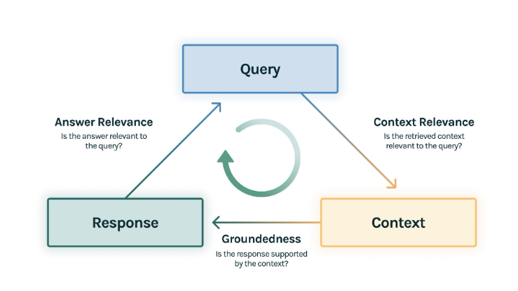
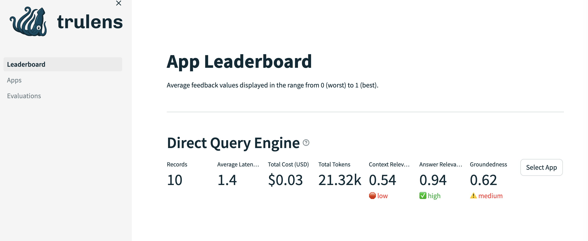
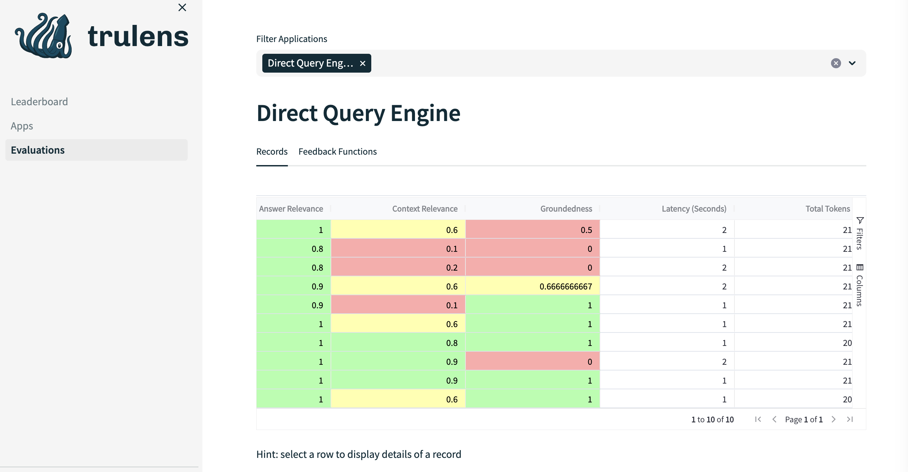
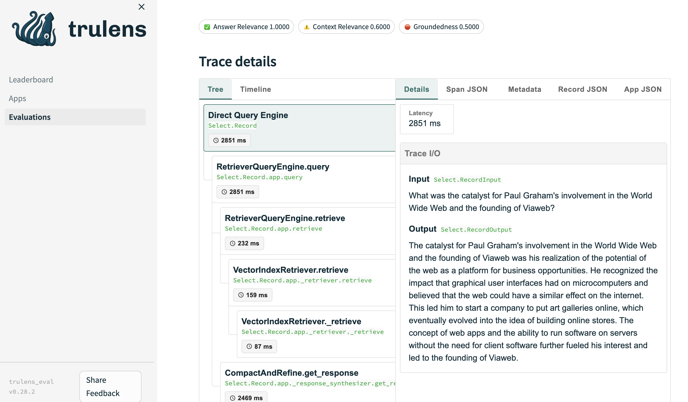

# Evaluating RAGs: The RAG Triad

## Summary

This article introduces a methodical approach to evaluating RAG, streamlining benchmarking, pipeline debugging, and gaining insights into errors.

## Introduction

Evaluating text generation models, such as Retrieval-Augmented Generation (RAG), presents a unique set of challenges compared to traditional machine learning assessment. Unlike standard models, evaluating text generation requires specialized methodologies due to the subjective and diverse nature of generated outputs. Metrics must capture not only quantitative aspects but also qualitative nuances, making evaluation highly dependent on the specific application domain. Consequently, assessing the performance of text generation models like RAG demands tailored approaches to effectively measure their effectiveness and quality.

While metrics like BLEU (Bilingual Evaluation Understudy) and ROUGE (Recall-Oriented Understudy for Gisting Evaluation) have traditionally been employed for evaluating text generation models, they often face limitations. Both BLEU and ROUGE metrics focus on measuring n-gram overlap between the generated text and reference text, which may overlook variations in vocabulary and word ordering.

Hence, evaluating the quality of chatbots has traditionally relied on gathering human feedback on a predefined set of commonly asked questions. However, advancements in AI capabilities have introduced a new trend known as AI-to-AI evaluation. This method involves feeding an AI model with the question asked and the corresponding response, tasking it with assessing the answer's quality and assigning a score. Remarkably, evaluations conducted by AI consistently align with those provided by humans, validating this approach. Moreover, it opens avenues for a significantly more cost-effective, rapid, and scalable approach to benchmarking models.

## The RAG Triad

An additional challenge specific to chatbots is their complex composition, comprising multiple components. When faced with poor performance, identifying the problematic component becomes challenging. Is it the indexing, retrieval, or perhaps the prompt generating the response? This is where the RAG Triad [2] comes into play, offering three metrics to pinpoint the failing part of the RAG model:



If the Context Relevance metric indicates poor performance, it suggests that the RAG struggles to retrieve relevant information to construct the context for generating answers. In such cases, exploring different indexing methods, embeddings, or implementing re-ranking techniques might be necessary.

Conversely, if the Context Relevance is satisfactory but the Groundedness is lacking, it indicates that the generation prompt needs refinement. Despite having the correct context, the language model fails to effectively utilize it. Experimenting with different prompts, language models or fine-tuning the existing one may be beneficial.

Lastly, the Answer Relevance metric serves as a sanity check, ensuring that the generated answer aligns with the query and provides helpful information.


### Prerequisites
 
We will employ the identical code base as seen in [Part 1](https://github.com/nnCharles/avancio/tree/main/practical_llm) to demonstrate the utilization of AI-to-AI evaluation. For this purpose, we will utilize the `trulens-eval` package, which not only incorporates the RAG triad but also offers an excellent user interface for gaining insights into the performance of the RAG model. Notably, it also grants the flexibility to define custom criteria for evaluating the quality of your RAG. To execute the provided code successfully, ensure that you have Python 3.11.7 installed, along with the specified dependencies. 
```py
jupyter
llama-index==0.10.34
llama-index-embeddings-huggingface==0.2.0
openai==1.25.1
python-dotenv #reads .env file
trulens-eval==0.28.2 #used to evaluate RAGs
```
Define the following variables in a `.env` file:
```py
OPENAI_API_KEY=<insert your OpenAI API key>
HUGGINGFACE_API_KEY=<insert your Hugging Face API key>
``` 

### Getting Data

Download a sample text file of Paul Graham's essay for demonstration:
```py
!mkdir -p '../data'
!wget 'https://raw.githubusercontent.com/run-llama/llama_index/main/docs/docs/examples/data/paul_graham/paul_graham_essay.txt' -O '../data/paul_graham_essay.txt'
```

### Naive RAG

We reuse the naive RAG defined in Part 1.
```py
from llama_index.core import SimpleDirectoryReader, VectorStoreIndex

documents = SimpleDirectoryReader(
    input_files=["../data/paul_graham_essay.txt"]
).load_data()
index = VectorStoreIndex.from_documents(documents)
query_engine = index.as_query_engine()
response = query_engine.query("What did Paul Graham study?")
str(response)
```

### Trulens Setup

We utilize the `Tru` class to access `trulens_eval` settings. All tables are stored in a local database, and we begin by clearing them.

```py
from trulens_eval import (
    Feedback,
    OpenAI
    Tru
    TruLlama,
)
from trulens_eval.feedback import Groundedness

tru = Tru()
tru.reset_database()
```

Trulens tracks all requests made to the query engine and requests the provider (e.g., LLM) to assess the quality of responses based on a set of feedback functions.

```py
tru_recorder = TruLlama(
    query_engine,
    app_id=app_id, #Name given to the experiment for benchmarking
    feedbacks=feedbacks
)
for question in eval_questions:
    with tru_recorder:
        response = query_engine.query(question)
```
Here, `eval_questions: List[str]` represents a list of questions we want our chatbot to answer. Various recorders are available; `TruLlama` is utilized with Llama-index, but there's also `TruChain` for Langchain, `TruRails` for NeMo-Guardrails, or even `TruCustom`.

As depicted, `feedbacks: List[Feedback]` functions are required. These functions calculate a score for a response based on specific criteria. Here's how they are defined:
```py
oai = OpenAI() #initialize the provider
qa_relevance = Feedback(
    oai.relevance_with_cot_reasons, #select the function we are interested in for the evaluation
    name="Answer Relevance"
)
.on_input_output() #specifies the arguments of the function 
```
For more details on the structure of Feedback functions, refer to [3], and you can find examples of already implemented feedback functions in [4].
 
## Visualizing your RAG performance

In the end, you simply need to execute these commands to compare the performances of the various query engines you wish to test:

```py
tru.get_leaderboard(app_ids=[])
tru.run_dashboard()
```
This will initiate a `streamlit` application and furnish you with the URL required to visualize your results.



The leaderboard provides an overview of the scores for all your experiments. In our scenario, we utilized Answer Relevance, Context Relevance, and Groundedness as feedback metrics. Additionally, we can evaluate toxicity, conciseness, and various other customized success criteria.



For every entry, we can examine the succession of functions invoked and pinpoint the stage in the pipeline where failure occurs for each entry. We analyze token usage and prompt the chatbot to adhere precisely to expected behavior.



## Sources

[1] [deeplearning.ai RAG course](https://www.deeplearning.ai/short-courses/building-evaluating-advanced-rag)

[2] [RAG Triad](https://www.trulens.org/trulens_eval/getting_started/core_concepts/rag_triad/)

[3] [Feedback anatomy](https://www.trulens.org/trulens_eval/evaluation/feedback_functions/anatomy/)

[4] [Stock Feedback Functions](https://www.trulens.org/trulens_eval/evaluation/feedback_implementations/stock/#trulens_eval.feedback.provider.base.LLMProvider.context_relevance)


## About The Author

Charles Camp is a seasoned ML engineer with nine years of experience, specializing in NLP. He's also an AWS Solution Architect Associate, skilled in deploying ML solutions.

After writing his Master thesis, using machine learning to build predictive models in the medical sector, at Carnegie Mellon University, Charles took on the challenge of combatting money laundering at Credit Suisse Zurich (Switzerland), where he first began utilizing NLP to identify negative news.

For the past four years, Charles has been freelancing, collaborating with startups and industry leaders to realize their NLP projects. During the last two years, he's been diving into the latest LLM tech, extracting valuable insights from company documents, building chatbots, and developing powerful recommender systems.