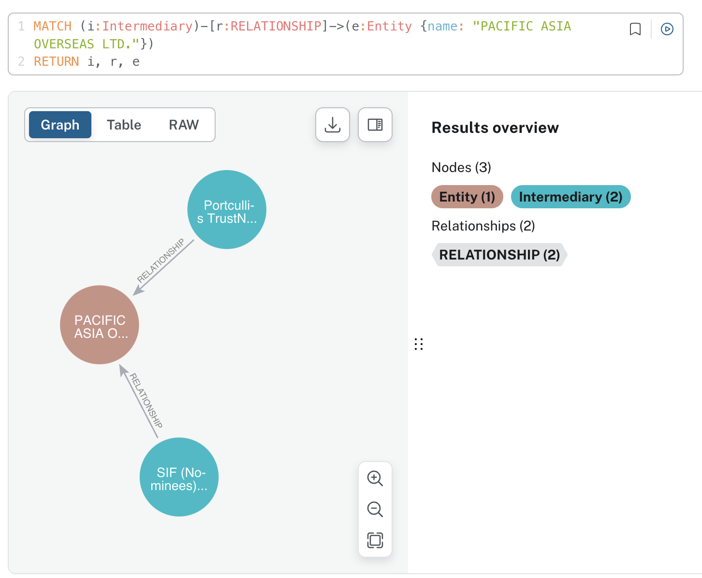

# Financial Crime Investigation With Neo4J and LLMs

## Summary

This article presents a method for utilizing Large Language Models (LLMs) to query a Neo4j graph constructed from the **International Consortium of Investigative Journalists Offshore Leaks Database**, aiming to gain insights and identify potential cases of money laundering.

## Introduction

### What are Knowledge Graphs?

Knowledge Graphs are structured representations of information that capture entities and their relationships. They are designed to integrate and organize vast amounts of data into a format that is both human-readable and machine-interpretable. By connecting related pieces of information, Knowledge Graphs facilitate more sophisticated querying, analytics, and inference, enabling the discovery of new insights and relationships within the data.

### Why are Knowledge Graphs Useful?

1. **Enhanced Data Connectivity:** Knowledge Graphs connect disparate data points, providing a holistic view of information. This connectivity makes it easier to uncover hidden relationships and patterns that might not be evident from isolated data points.

2. **Improved Data Integration:** They facilitate the integration of data from various sources, breaking down data silos and ensuring that all relevant information is linked and accessible.

3. **Advanced Query Capabilities:** With Knowledge Graphs, users can perform complex queries that traverse multiple layers of data relationships, offering more precise and insightful answers than traditional databases.

4. **Better Contextual Understanding:** By representing entities and their relationships, Knowledge Graphs provide context to data, enhancing the understanding and interpretability of the information.

5. **Support for AI and Machine Learning:** Knowledge Graphs serve as a rich source of structured data that can be leveraged by AI and machine learning models for tasks such as natural language understanding, recommendation systems, and predictive analytics.

### What is Neo4j?

Neo4j is a leading graph database management system designed to store, query, and manage large-scale graph data. Unlike traditional relational databases that use tables to represent data, Neo4j uses graph structures with nodes, edges, and properties to represent and store data. This graph-based approach makes Neo4j highly efficient for managing and querying complex data relationships.

#### Key Features of Neo4j:

1. Graph Model: Uses nodes to represent entities and relationships (edges) to connect them.
2. Scalability: Efficiently handles large volumes of connected data.
3. Flexibility: Easily adapts to evolving data structures without requiring extensive schema modifications.
4. High Performance: Optimized for graph traversals, offering fast query execution for complex relationship queries.

### What is Cypher?

Cypher is a powerful query language designed specifically for working with graph data in Neo4j. It provides a simple and expressive syntax for querying and updating graph structures, allowing users to easily specify patterns of nodes and relationships to be matched or created within the graph.

### Leveraging Large Language Models (LLMs) for Knowledge Graphs

With advancements in AI and natural language processing, Large Language Models (LLMs) like GPT-4 have become powerful tools for generating text and understanding context. By leveraging LLMs, we can automate the generation of Cypher statements, simplifying the process of handling Knowledge Graphs in Neo4j. This integration allows us to harness the strengths of AI to enhance data connectivity, query capabilities, and overall knowledge management.

In the following sections, we will explore how to use LLMs to generate Cypher statements for querying a Knowledge Graph in Neo4j, demonstrating the practical applications and benefits of this approach.

All the code used for this example is publicly available on GitHub: [https://github.com/nnCharles/avancio/tree/main/practical_llm](https://github.com/nnCharles/avancio/tree/main/practical_llm).

### Neo4j Setup

To run Neo4J locally, you will need to have the Java Development Kit (JDK) 17 installed. Here is how to do it on a Mac:

#### JDK-17 Installation

```py
java -version
curl -L -b "oraclelicense=a" -O https://download.oracle.com/java/17/latest/jdk-17_macos-x64_bin.tar.gz
tar -xvzf jdk-17_macos-x64_bin.tar.gz
sudo mkdir -p /Library/Java/JavaVirtualMachines
sudo mv jdk-17.0.11.jdk /Library/Java/JavaVirtualMachines/
export JAVA_HOME=/Library/Java/JavaVirtualMachines/jdk-17.0.11.jdk/Contents/Home
```

You will also need to install Neo4J. For this example, I chose to download only Neo4J Community, which is free. Here are the steps to get it started:

#### Neo4J Installation

```sh
mv ~/Downloads/neo4j-community-5.20.0 ~
shasum -a 256  ~/Downloads/neo4j-community-5.20.0-unix.tar.gz
bin/neo4j-admin server validate-config
bin/neo4j start
```

Access the Neo4J browser by navigating to http://localhost:7474 in your web browser. Unless set explicitely, the default username and password are set to 'neo4j'.

### Data Ingestion

This ICIJ database contains information on more than 810,000 offshore entities that are part of the Pandora Papers, Paradise Papers, Bahamas Leaks, Panama Papers, and Offshore Leaks investigations. For illustrative purposes, we have decided to restrict this example to 1,000 entities and only officers located in Switzerland (CHE).

In Cypher, data is loaded using the `LOAD CSV` statement. For example, this is how we loaded the Officer file:

#### Example Cypher Statement for Loading Officer Data

```sh
LOAD CSV WITH HEADERS FROM 'path/to/your/csv/file' AS row
WITH row
WHERE row.country_codes = 'CHE'
MERGE (o:Officer {id: row.node_id})
SET o.name = row.name,
    o.country = row.country_codes
```

### Query the Graph database with LLMs

Once the graph is built, we can use the `Neo4jGraph` class from `langchain_community` to interact with it. For this, we need to define some environment variables in a `.env` file:

```sh
NEO4J_URI=http://localhost:7687
NEO4J_USERNAME=neo4j
NEO4J_PASSWORD=neo4j
OPENAI_API_KEY=<your_openai_api_key>
```

We use the `python-dotenv` library to handle environment variables. This function will load all the environment variables defined in the `.env` file and set the OpenAI API key.

```py
def setup():
    _ = load_dotenv(find_dotenv())
    try:
        openai.api_key = os.getenv("OPENAI_API_KEY")
    except:
        print("OPENAI_API_KEY not found,")
```

We start by defining the Neo4J graph.

```py
from langchain_community.graphs import Neo4jGraph
graph = Neo4jGraph()
graph.refresh_schema()
print(graph.schema)
```

Output:

```
Node properties:
Intermediary {id: STRING, name: STRING, country: STRING}
Officer {id: STRING, name: STRING, country: STRING}
Entity {id: STRING, name: STRING, jurisdiction: STRING, incorporation_date: DATE, status: STRING, country: STRING, source: STRING}
Relationship properties:
RELATIONSHIP {type: STRING}
The relationships:
(:Intermediary)-[:RELATIONSHIP]->(:Entity)
(:Officer)-[:RELATIONSHIP]->(:Entity)
```

Then, we create the `GraphCypherQAChain` which takes as parameters the graph and a LLM model in this case, we use `gpt-3.5-turbo` from OpenAI:

```py
from langchain.chains import GraphCypherQAChain
from langchain_openai import ChatOpenAI

llm = ChatOpenAI(model="gpt-3.5-turbo", temperature=0)
chain = GraphCypherQAChain.from_llm(graph=graph, llm=llm, verbose=True)
```

Now we can start using the `GraphCypherQAChain` class to query our graph. The questions are converted to Cypher statements, whose outputs are used as context to generate the final answer:

```py
response = chain.invoke({"query": "How many intermediates deal with PACIFIC ASIA OVERSEAS LTD.?"})
print(response)
```

Output:

```
> Entering new GraphCypherQAChain chain...
Generated Cypher:
MATCH (i:Intermediary)-[:RELATIONSHIP]->(e:Entity)
WHERE e.name = 'PACIFIC ASIA OVERSEAS LTD.'
RETURN COUNT(i)
Full Context:
[{'COUNT(i)': 2}]

> Finished chain.
{'query': 'How many intermediates deal with PACIFIC ASIA OVERSEAS LTD.?',
 'result': 'There are 2 intermediates that deal with PACIFIC ASIA OVERSEAS LTD.'}
```

We can quickly verify the data directly in the Neo4J database:



## Conclusion

In conclusion, graph databases provide an efficient, visual, and scalable method for organizing data. With the advancements in LLMs, these databases can now be queried directly by converting natural language questions into Cypher statements automatically. This innovation significantly enhances the capabilities of financial crime investigators, offering them powerful new tools to support their research and uncover hidden relationships within complex data sets.

## Sources

[1] [Neo4J Installation Manual](https://neo4j.com/docs/operations-manual/current/installation/)

[2] [International Consortium of Investigative Journalists - Offshore Leaks Database](https://offshoreleaks.icij.org/pages/database)

[3] [Neo4J/Langchain Documentation](https://neo4j.com/labs/genai-ecosystem/langchain/)

## About The Author

Charles Camp is a seasoned ML engineer with nine years of experience, specializing in NLP. He's also an AWS Solution Architect Associate, skilled in deploying ML solutions.

After writing his Master thesis, using machine learning to build predictive models in the medical sector, at Carnegie Mellon University, Charles took on the challenge of combatting money laundering at Credit Suisse Zurich (Switzerland), where he first began utilizing NLP to identify negative news.

For the past four years, Charles has been freelancing, collaborating with startups and industry leaders to realize their NLP projects. During the last two years, he's been diving into the latest LLM tech, extracting valuable insights from company documents, building chatbots, and developing powerful recommender systems.
